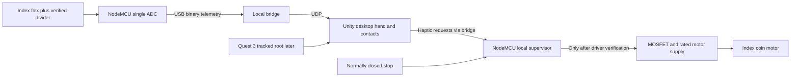
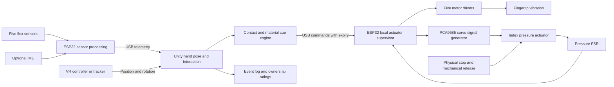

# AHAM — technical architecture and 40-hour build plan

## Selected WebXR revision — 7 October 2026

The team has selected **a wireless WebXR browser app on Meta Quest 3, without Unity**. Quest hand joints replace flex sensors and MPU6050 as primary tracking. Retain vibration/servo hardware for output. Follow the [current architecture and remaining-time checkpoints](docs/webxr-architecture.md) and [WebXR quickstart](docs/webxr-quickstart.md); these supersede the sensing and Unity choices below. The forty-hour event clock continues. Current browser/relay software is monitor only; physical vibration and servo resistance are unverified.

The earlier plan below records the sensor-based fallback and received kit.

AHAM is a bidirectional interface between a physical hand and a virtual hand. Finger movements animate the virtual hand; virtual contact produces physical feedback on the glove. The Makeathon demonstration explores whether synchronized movement and contact cues influence the participant's reported sense of ownership of the virtual hand.

This plan is based on the referenced conversation, **Suggest Project Theme**. The revision below uses the team's actual received inventory and supersedes the original ESP32/power/sensor availability assumptions in the target architecture that follows.

## Received-kit revision — 7 October 2026

Four teammates; headset later: **Meta Quest 3**. Received: ESP-12E NodeMCU V3 (**ESP8266, one ADC**), five flex sensors, MPU6050, PCA9685, MG90S x4, SG90 x1, Grove GSR, glove, one coin motor, PAM8403, breadboard, 5 V / 2 A adapter. Four coin motors are pending. No divider resistors, motor driver, extra ADC/multiplexer or FSR is available.

**Selected first hardware deliverable: one physical index finger, one flex sensor and one coin motor.** Complete this loop before expanding. No external ADC is required now; GSR remains disconnected from the occupied A0 input. Follow the [index-finger implementation guide and driver parts](docs/index-finger-mvp.md). Five-finger tracking, Quest 3 tracking and mechanical feedback are later milestones. The 2 A adapter does not establish capacity for five loaded servos.

| Event hours, from original start | Revised integration gate |
|---|---|
| 0–3 | Desktop simulator/Unity import and component wait; retain completed work |
| 3–6 | A: NodeMCU USB/probe + I2C; B: Unity simulation; C: glove mounting layout; D: obtain missing parts and verify adapter/motor labels |
| 6–10 | A/D: one verified flex divider and real USB telemetry; B: index mapping; C: mount without servo tension |
| 10–13 | Off-hand single motor driver, stop/timeout tests; then index contact loop if hardware prerequisites are met |
| 13–20 | Stabilize index motion/contact, verify correct finger mapping, then mount the verified sensor/motor with strain relief |
| 20–28 | Repeat index contact/release, stop, timeout, reset and disconnect tests. Add Quest 3 only if assigned and the desktop loop is stable |
| 28–34 | Freeze working scope; rehearse and record the actual delivered loop; exploratory GSR only if analog capacity/time remain |
| 34–40 | Repeat setup, demo script, backup recording and presentation. State actual channel count and desktop/VR status |

If missing divider/driver parts remain unavailable, preserve the desktop demo and board checks without claiming physical haptics. The index-finger loop is the chosen hardware MVP, not merely a fallback. Five-finger hardware and mechanical feedback are expansion work after this milestone passes. These are event-hour gates, not a fresh forty-hour extension.

The detailed architecture below remains the expansion reference. Follow the received-kit wiring guide for today's board, pin map and power constraints.

## 1. Delivery scope

**At hour 40: one index-finger hardware loop, one Unity desktop scene, calibrated index curl, matching index vibration, verified stop/timeout behavior and a repeatable demonstration.** Hardware completion depends on obtaining and validating the divider and motor-driver parts.

The four-person team has received the kit and has a compiled Unity desktop project. The original approximately three-hour component wait remains included in the forty-hour event budget. Meta Quest 3 arrives later. Forty hours means elapsed event time, not forty person-hours; this scope change does not restart the clock.

| Priority | Deliverable | Completion condition |
|---|---|---|
| Required | Index-finger curl tracking | Open, half-closed and comfortably closed index poses map consistently |
| Later | Tracked hand root in VR | Quest 3 tracking and mounting validated after the desktop loop |
| Required | One index vibration channel | Index virtual contact activates only the index motor |
| Required | Three interaction surfaces | Smooth, rough and soft objects produce repeatably different cue patterns |
| Optional after core loop | Exploratory ownership demonstration | Synchronized index motion/contact and separately reported participant ratings |
| Required | Calibration, fault handling and a backup recording | Repeated setup and reconnect work without unintended actuation |
| Later | Index-fingertip pressure | A compliant pad presses and releases repeatably, with local sensor and travel limits |
| Stretch | One-finger tendon resistance | A separate mechanism demonstrably opposes closure and releases reliably |
| Stretch | GSR logging | Available module produces time-aligned exploratory skin-conductance readings |
| Later | Five-finger pressure/resistance, wireless, custom PCB | Outside the committed 40-hour scope |

The earlier five-servo design remains an expansion path. Building five reliable tendon mechanisms and five pressure tactors within this event is too large a commitment. Prioritize a complete interaction loop before expanding actuator count.

If only one or two builders are available, commit to tracking, vibration and the ownership demo. Keep mechanical pressure and resistance as later work.

## 2. What the participant feels

| Feedback | Physical mechanism | Defensible description |
|---|---|---|
| Vibration | Coin/ERM motor on a fingertip | Contact event and texture-associated cues |
| Pressure | Soft pad moved against the index fingertip | Actual local tactile pressure |
| Resistance | Tendon whose geometry opposes finger closure | Limited resistance to movement, after validation |

Vibration does not reproduce a solid wall. A pressing pad adds local pressure but does not stop the finger passing through a virtual surface. Tendon resistance is a third, separate function. The demonstration must identify which channels are actually active.

## 3. Expansion architecture reference

The diagram shows the target pressure enhancement. Tendon resistance and GSR are optional branches rather than dependencies of the core loop.

**Control separation:** Unity decides which virtual contact should be represented. ESP32 decides whether the requested output is permitted and enforces local limits. Loss of Unity or communication must not leave an indefinitely active haptic command.

### Hand pose and tracking

Use flex sensors for normalized finger curl, not independent measurement of every finger joint. Distribute each curl over the hand rig's joint rotations using tuned pose curves. The thumb needs its own mapping; finger spread and full thumb opposition are outside scope.

Use the VR controller/tracker for both position and orientation of the hand root. Fix it rigidly to the back of the hand where its tracking features remain visible and fingers remain free. Establish the controller-to-hand offset during calibration. Unity's XR Origin converts tracked device poses into scene coordinates. [Unity XR Origin documentation](https://docs.unity3d.com/6000.0/Documentation/Manual/xr-origin.html)

Do not assume that a controller held in the palm permits an unrestricted glove demo, or that optical hand tracking will see through the glove. Verify the actual mount by hour 5. A forearm-mounted controller does not directly measure wrist articulation.

The ICM-20948 is optional for motion diagnostics or a separately calibrated orientation fallback. Do not independently apply tracker and IMU rotations to the same hand root. Do not integrate IMU acceleration as the primary absolute-position source.

### Glove electronics

Flex sensors and FSRs use voltage-divider inputs kept within the selected ESP32 board's ADC limits. Start with five flex channels and one pressure FSR. For a classic ESP32 DevKit with six exposed ADC1 inputs, this can fit without an external ADC; verify the exact board before assigning pins. Expansion to five flex plus five FSR channels needs a revised input plan, such as an analog multiplexer or additional ADC channels. ADC2 on the classic ESP32 is shared with Wi-Fi, so a future wireless version must account for that. [Espressif ADC documentation](https://docs.espressif.com/projects/esp-idf/en/v5.5.3/esp32/api-reference/peripherals/adc_oneshot.html)

Drive each vibration motor through a 3.3 V-compatible logic-level MOSFET, with a gate resistor, gate pulldown and flyback protection. Select the motor supply for its rated voltage; a nominal 3 V motor should not automatically receive 5 V. Test startup duty and useful intensity range because ERM duty is not a linear measure of perceived intensity.

Use PCA9685 for servo control signals only. It does not supply servo power or measure force. All PCA9685 channels share one PWM frequency; keep vibration PWM on separate ESP32 outputs. Connect its OE input to a default-disabled circuit and local fault handling. OE disables signal outputs, not servo supply power. [NXP PCA9685 datasheet](https://www.nxp.com/docs/en/data-sheet/PCA9685.pdf)

Use a separate regulated actuator supply with common ground, appropriate wiring, branch protection and local decoupling. Size it from the actual motors' and servos' current specifications and measured simultaneous load; the earlier 5 V, 6 A request is a provisional procurement allowance, not a verified requirement. Do not power servos from the ESP32 USB/3.3 V rail or backfeed USB power.

Use an ICM-20948 breakout with documented voltage regulation and logic translation compatible with ESP32. Breakout-board compatibility must be checked rather than inferred from the chip name. [SparkFun breakout hookup guide](https://learn.sparkfun.com/tutorials/sparkfun-9dof-imu-icm-20948-breakout-hookup-guide/all?print=1)

### Index pressure mechanism

Build a light fingertip housing with a broad soft pad, a compliant return, limited mechanical travel and a quick-release strap. Mount the positional micro servo on an external fixture or forearm support; a guided cable or linkage moves the pad. Keep the contact travel small and establish the operating range on the bench before fitting it to a person.

Place the FSR in the pad's compression load path with a suitable backing and consistent contact area. An FSR responds to applied compression; an FSR simply taped to a fingertip does not automatically measure tendon tension. [Interlink FSR description](https://www.interlinkelectronics.com/force-sensing-resistor)

Calibrate the assembled mechanism. Report raw or normalized pressure-sensor response unless a known-load calibration supports a force estimate. The FSR is a supplementary limit input, not an independent guarantee that the mechanism is safe.

Start with a conservative position lookup and a bounded ramp toward a low pressure target, overridden by sensor/travel/time limits. Avoid an untuned high-gain force controller. Keep free, low and medium pressure presets rather than claiming accurate continuous force rendering.

### Optional tendon resistance

A positional servo is not inherently a force actuator. Cable routing must make tendon length increase with finger closure so tension actually opposes closure; a mechanism that assists flexion will pull the finger inward instead.

Validate routing, compliance, travel and release on a jig. Tendon tension needs an inline load cell or a calibrated mechanism that converts tension into sensed compression. The pressure pad's FSR is not automatically a tendon-force sensor.

If this cannot be verified independently without disturbing the core demo, present the mechanism on the bench as future work. Do not add a worn resistance channel just to claim five-servo force feedback.

## 4. Software responsibilities

| Module | Responsibilities |
|---|---|
| ESP32 SensorReader | Acquire flex and FSR samples; optional IMU read; detect invalid/saturated readings |
| ESP32 CalibrationStore | Save open/closed flex references and actuator-specific bounds |
| ESP32 Transport | Frame packets, verify integrity, sequence numbers and command expiry |
| ESP32 ActuatorSupervisor | Default-off state, bounded output, timeout, stop input and fault latch |
| ESP32 HapticDrivers | Five independent motor patterns and pressure servo updates |
| Unity SerialTransport | Background serial I/O, bounded queues and latest valid telemetry |
| Unity HandPoseMapper | Tracker offset, curl-to-bone mapping and calibration interface |
| Unity ContactResolver | Per-finger overlap/contact state, hysteresis and object priority |
| Unity MaterialProfile | Contact pulse, sliding pattern and optional pressure preset |
| Unity HapticCommandBuilder | Send a complete desired actuator state with sequence and expiry |
| Unity ExperimentLogger | Timestamp events, conditions, ratings, packet loss and latency measurements |
| Unity DemoUI | Connection/tracking status, calibration, active feedback mode and stop control |

Serial I/O must not block Unity's rendering thread. Apply scene-object changes on Unity's main thread. Avoid accumulating old packets; preserve the latest valid state and log drops.

Use a tracked target hand and a separate visual/contact representation. Fingertip trigger colliders identify overlap; optionally constrain a visual fingertip at a contact proxy while retaining the target pose as an input. Directly driven hand transforms can pass through geometry, so collision detection alone does not enforce physical solidity. Basic grasping can attach an object after thumb/index proximity plus curl checks, then release with hysteresis.

Use explicit contact state: **free -> contact -> sliding/grasp -> release**. Add enter/exit hysteresis, a minimum pulse interval and multi-object priority so contact jitter does not retrigger motors continuously.

## 5. Data and timing contract

These are implementation targets, not measured performance claims.

| Path | Target |
|---|---|
| Flex/FSR acquisition and local supervision | 100 Hz |
| ESP32 telemetry | 100 Hz, compact frames up to 64 bytes |
| Unity contact processing | Approximately 50–100 Hz, tuned with the scene |
| Haptic command refresh | 50 Hz; full desired state, including zeros on release |
| USB serial | Start at 230400 baud; verify both endpoints |
| Pressure servo updates | Servo-specific rate; start near 50 Hz if supported |
| Haptic command lease | 100 ms from receipt of a fresh valid command |
| Communication fault latch | At 150 ms without valid refresh; release begins at lease expiry |
| Tracking-data loss | Unity requests zero outputs; ESP32 timeout remains independent |

At 100 Hz, 64-byte telemetry requires 6.4 kB/s, or approximately 64 kbit/s with standard 8N1 serial framing. This leaves practical headroom at 230400 baud before accounting for implementation overhead. Confirm packet loss and timing on the actual system.

**Telemetry fields:** protocol version, sequence, device uptime, five normalized curls, active FSR readings, optional IMU quaternion, status flags and integrity check.

**Command fields:** protocol version, sequence, lease duration, five vibration intensities/pattern IDs, pressure target, actuator mode and integrity check. Unity sends normalized requests, not unrestricted servo angles. Device firmware stores the permitted actuator mapping.

Use a framed binary protocol such as COBS with CRC16; expose readable diagnostics separately. Ignore malformed, out-of-range and duplicate/out-of-order commands. Clamp the accepted lease duration in firmware. Version the contract before parallel implementation.

For flex calibration, sample a comfortable open hand and comfortable closed hand with actuators released. Normalize using `curl = clamp((raw - open) / (closed - open), 0, 1)`, reject insufficient calibration span, and filter only as much as needed to suppress visible jitter.

Measure software command timing separately from physical actuator onset. Target median virtual-contact-to-vibration onset below 100 ms; ERM spin-up and servo response can dominate. Use slow-motion recording or an instrumented sensor to verify physical onset rather than presenting serial round-trip time as tactile latency.

## 6. Local actuator states and release behavior

Firmware states: **BOOT/DISARMED -> CALIBRATING -> ARMED -> FAULT/DISARMED**. Enter ARMED only after valid calibration and explicit local/demo arming. A reconnection must not automatically re-arm an actuator.

On contact loss, command expiry, tracking loss, invalid pressure reading, excessive sensor response, stop input or excessive actuation duration: stop vibration and begin pressure release. Set pressure limits, servo travel/slew limits and maximum continuous-contact duration from bench tests. Initial demo contact is brief; start with a 2-second actuation cap and test it.

If firmware is healthy and power remains, command the verified release position before disabling outputs. If firmware resets, the default circuit must disable outputs; provide a physical actuator-power switch and a direct mechanical release that the user or teammate can reach.

**Cutting servo power or disabling PCA9685 PWM does not guarantee that a geared servo will unwind.** Verify that the quick release removes pressure/tension without software. Do not rely on motor power loss as the sole release mechanism.

## 7. Procurement and preparation

| Item | Target quantity/use |
|---|---|
| ESP32 DevKit and data-capable USB cable | 1 working set; spare cable desirable |
| Flex sensors and divider components | 5 channels |
| Coin/ERM motors | 5, with documented rated voltage/current |
| Motor driver components | 5 independent MOSFET channels plus protection |
| VR headset/controllers and development PC | 1 compatible, tested set |
| Positional micro servo | 1 pressure channel; optional second actuator for separate resistance work |
| PCA9685 breakout | 1; OE accessible and logic voltage verified |
| FSR | 1 used for pressure MVP; up to 5 reserved for later expansion |
| ICM-20948 breakout | 1 optional; compatible level shifting documented |
| Actuator supply and wiring | Sized from actual load, with switch/protection/decoupling |
| Glove/mechanics | Stretch glove, soft pad, straps, guides, cable, compliant returns and release hardware |
| Assembly/test equipment | Soldering tools, multimeter, connectors, strain relief; known loads or force gauge for calibration if available |
| GSR module with electrodes | 1 optional; does not block core demo |
| ADC/multiplexer expansion | Only needed if the chosen board cannot cover inputs or full FSR expansion is attempted |

Use stock rigged models, simple objects and readily fabricated mounts. Do not spend event time on a custom PCB or realistic environment artwork.

## 8. Original expansion schedule (superseded)

The received-kit schedule at the top of this document is the current forty-hour plan. The table below records the earlier five-finger/pressure proposal and is not a requirement for the selected index-finger MVP.

Suggested ownership: **A** embedded/electronics; **B** Unity/VR; **C** mechanics/actuator validation; **D** integration, logging, demo and support. With three people, combine D with the other roles and omit stretch work. Rotate breaks while another teammate covers the active integration task.

| Elapsed hours | A — embedded/electronics | B — Unity/VR | C — mechanics | D — integration/demo | Required gate |
|---|---|---|---|---|---|
| 0–3 | Prepare firmware modules and packet parser using simulated inputs | Rig hand; create scene and synthetic telemetry source; test VR if already available | Sketch mount, pad, cable routing and release; prepare fabrication files/materials | Freeze scope/protocol; organize shared project and checklist | Software foundation ready before hardware arrives |
| 3–5 | Inventory/verify supply and board; read one flex sensor; drive one motor | Connect real telemetry; validate headset/platform | Fit glove and verify tracker mount; check servo travel off-hand | Test USB link and document actual components | Headset tracking and one sensor/motor work |
| 5–9 | Five flex channels and calibration | Serial receiver and five-finger mapping | Fit sensors, isolate wiring strain | Log readings and perform pose checks | Physical movement animates virtual hand |
| 9–13 | Five motor drivers; output timeout | Fingertip contacts and material profiles | Secure motors and glove; start pressure jig | Test every finger ID and contact/release | Full motion -> contact -> vibration loop |
| 13–17 | FSR read and actuator limits | Smooth/rough/soft scene and simple grasp | Pressure jig: pad, return, stops and release | Check power stability and reconnect | Stable core demo; pressure bench decision |
| 17–20 | Pressure presets and fault handling | Tracker calibration and contact hysteresis | Validate pressure response and release | Measure contact timing; repeat fit/calibration | Pressure mechanism passes bench tests |
| 20–24 | Integrate pressure only if validated | Send pressure requests on index contact | Refine fit; optional separate tendon jig | Connect logger and ownership ratings | Enhanced demo or formal fallback selected |
| 24–28 | Fix errors and tune filters | Complete ownership condition and appearance change | Verify stop/release with integrated setup | Repeat scripted runs and check logs | All committed features stable |
| 28–30 | Stretch only if core is stable | Optional GSR view or small demo refinement | Optional verified resistance; otherwise support core | Review remaining defects | Feature freeze at hour 30 |
| 30–34 | Fault, timeout and power checks | Tracking/contact/performance fixes | Final cable routing and comfortable fit | Reliability runs and measurement summary | Demo survives failures and restarts |
| 34–36 | Package firmware and settings | Package executable/project | Prepare hardware setup labels | Capture backup video and draft presentation | Portable deliverables ready |
| 36–38 | Support rehearsal and urgent fixes | Support rehearsal and urgent fixes | Fit and release rehearsal | Three consecutive full demo rehearsals | Presentation ready |
| 38–40 | Buffer and final setup | Buffer and final setup | Buffer and final setup | Check submission and run final demo | Final delivery |

The critical path is **one flex sensor -> serial -> virtual finger -> virtual contact -> one motor -> all five fingers -> validated pressure integration -> reliability -> rehearsal**.

Mechanical pressure development runs in parallel and joins only after it passes its own gate. It must not block the core glove loop.

## 9. Decision gates and fallback rules

- **Hour 5:** If PC VR/tracker mounting fails, preserve the glove pipeline in a desktop scene while diagnosing VR. A mouse/script-driven root is a desktop fallback and must be described as such; it is not measured 6-DoF hand tracking.
- **Hour 9:** If all flex channels are not stable, complete index and thumb first; scale the others after the end-to-end loop works.
- **Hour 13:** If multi-finger feedback remains unreliable, stabilize the index channel before adding mechanics. Preserve full-hand visuals with the working sensors.
- **Hour 17:** If pressure travel, sensor response or release cannot be demonstrated on the jig, retain vibration as the event deliverable and keep the pad as a bench prototype.
- **Hour 24:** Confirm the exact presentation scope. Unreliable pressure becomes a bench-only exhibit. Tendon resistance remains optional and must have separate validation.
- **Hour 30:** Freeze features. Spend the remaining ten hours on failures, packaging and demo practice.

## 10. Verification and acceptance

| Check | Pass condition |
|---|---|
| Finger identity | Each sensor animates the correct finger and each contact activates the correct motor |
| Calibration | Open/half/closed poses repeat; failed/insufficient-span calibration is rejected |
| Contact stability | Resting contact does not repeatedly retrigger onset pulses; withdrawal sends zero output |
| Material cues | Smooth/rough/soft patterns are visibly logged and distinguishable in a short pilot |
| Pressure enhancement | At least 20 bench press/release cycles without sticking, overtravel or unexplained sensor behavior |
| Communication failure | Unplug USB/stop Unity; local lease expires and output transitions to its tested release behavior |
| Tracking failure | Invalid/lost pose clears requests; reconnect does not silently re-arm pressure |
| Device restart | Servo signal remains disabled at boot and calibration/arming is required |
| Mechanical release | Pressure/tension can be removed directly even when power/control is unavailable |
| Power stability | Simultaneous demo outputs produce no controller reset or persistent bad sensor data |
| Physical latency | Record median and worst observed onset over at least 20 contacts; separate vibration and pressure results |
| Demo reliability | Three consecutive 3-minute runs without reset, missed release or manual software repair |

Demonstrate fault cases on the bench before participant use. If any mechanical output fails release verification, disable it for the worn demonstration and keep the tracking/vibration loop operational.

## 11. Body-ownership demonstration and presentation

Use one simple scene: a table, three materials and a visible virtual hand. Calibrate, show live finger motion, touch surfaces and show the matching motors. Add the index pressure demonstration if validated. Then change the virtual hand's appearance while preserving synchronized tracking.

For an exploratory comparison, run a synchronized condition and a deliberately delayed **vibration-only** condition, counterbalancing the order across participants. Release/disarm mechanical pressure/resistance during the delayed condition. Collect separate 1–7 ratings for “the hand felt like part of my body” and “the hand moved as I intended.” Save condition order and event timestamps. A few event participants provide pilot observations rather than proof of an ownership effect.

GSR, if available, is an optional arousal trace; it cannot establish body ownership by itself. Use its module's documented electrode/setup instructions and avoid letting it consume integration time needed for the glove.

Suggested 3-minute demo:

1. **0:00–0:30:** Explain the real-hand -> virtual-hand -> physical-feedback loop.
2. **0:30–1:00:** Calibrate and show five-finger tracking.
3. **1:00–1:45:** Touch three virtual surfaces and identify active feedback channels.
4. **1:45–2:15:** Show validated index pressure, or the clearly labeled bench prototype.
5. **2:15–2:45:** Change hand appearance and show an ownership rating/condition comparison.
6. **2:45–3:00:** Present measured timing, limitations and the five-finger expansion path.

## 12. Final deliverables

- ESP32 firmware, calibration values, packet specification and wiring record.
- Unity project, executable and reusable hand/material profiles.
- Working glove with labeled stop/release and a setup checklist.
- Actual capability matrix identifying tracking, vibration, pressure and resistance channels delivered.
- Verification record with timing, repeatability and failure behavior.
- Timestamped demo/ownership logs and optional GSR readings.
- Backup video and a concise presentation: problem, architecture, physical feedback, ownership demo, measured results and next steps.

Presentation wording: **“AHAM maps physical finger motion into VR and returns synchronized contact cues. Our prototype provides [the verified feedback channels], and we explore how synchronization affects reported ownership of the virtual hand.”** Replace the bracketed phrase with the capabilities actually demonstrated.
