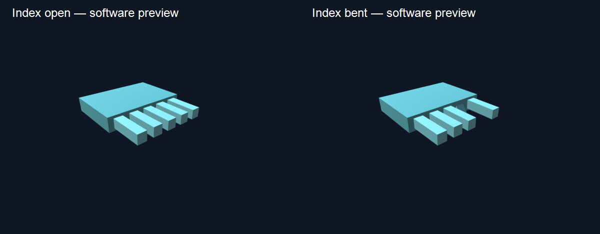

# Make progress before the resistors arrive

The current milestone is **one index finger on a desktop**. Software preview works immediately. Physical flex sensing waits for the divider resistors. The motor stays disconnected until its driver and supply are verified.

## 1. See movement now — no board required

1. Open the repository's `unity` project. If it is already open, **stop Play mode**, wait for script compilation, then press **Play** again.
2. Open `Assets/AHAM/Scenes/AhamStarter` if a different scene is open.
3. **Software preview: no hardware needed** is enabled by default. Watch the index finger curl and the wrist tilt automatically.
4. Uncheck **Animate finger and wrist automatically**. Move **Index bend**, **Wrist tilt** and **Wrist roll** sliders.
5. Keep the preview checkbox on for this exercise. Preview blocks outgoing motor commands. No Python bridge, serial connection, resistor, calibration or headset is needed.

These movements are generated by software. They demonstrate the hand model and controls; they are not measurements from your glove.



## 2. Optional: connect the MPU6050 now

This is the first available physical input without the flex divider. Use a **verified 3.3 V-compatible MPU6050 breakout with onboard I2C pull-ups**. If its supply/pull-ups are unknown, complete the software exercise first and verify the module before wiring. Do not use 5 V pull-ups with NodeMCU.

Disconnect USB before wiring. Leave flex sensor, motor, PCA9685 and servos disconnected.

| MPU6050 breakout | NodeMCU V3 |
|---|---|
| VCC (verified 3.3 V input) | 3V3 |
| GND | GND |
| SDA | D2 / GPIO4 |
| SCL | D1 / GPIO5 |
| AD0, if exposed | GND for address 0x68 |
| INT | Leave unconnected |

1. Reconnect USB. Close Serial Monitor and stop any old bridge/simulator.
2. Upload the **updated repository firmware** from VS Code/PlatformIO, environment **nodemcuv2**. An older uploaded ZIP sketch does not include this new MPU path. From the repository root:

   ```powershell
   .\.venv\Scripts\python.exe -m platformio run --project-dir firmware -e nodemcuv2 --target upload --upload-port COM7
   ```

   COM7 was identified on this laptop; confirm the port if it has changed. To use your separate PlatformIO project, replace its `src/main.cpp` and matching headers together from the updated export; do not mix versions.

3. Start the updated bridge from the repository root:

   ```powershell
   .\.venv\Scripts\python.exe host/run.py bridge --port COM7
   ```

4. Stop and restart Unity Play mode. **Uncheck Software preview**. Keep **Enable outgoing commands** unchecked.
5. Expand **Calibration / hardware settings**, then enable **Use MPU6050 for slow wrist tilt**. Wait for **MPU6050 data connected**, hold the sensor in a neutral pose, and click **Center wrist in neutral pose**.
6. Tilt the module slowly. The virtual hand should tilt. The flat index finger is expected until the flex divider is built and calibrated.

This uses accelerometer gravity for a two-axis tilt proxy, with smoothing. Module X/Y/Z axes map to the demo's pitch/roll axes; mount in a consistent orientation and recenter. It does not measure hand position, yaw or robust orientation during fast acceleration. Gyroscope samples are transmitted but are not fused into the displayed pose. The code has compiled and packet/tilt calculations are tested; your physical MPU wiring and response still need validation. An absent sensor does not prevent software preview.

## 3. Four people, four concrete tasks

| Person | Work now | Completion evidence |
|---|---|---|
| Unity | Run auto preview, test all three manual sliders, record 20 seconds | Visible index curl and wrist tilt |
| Embedded | Verify MPU breakout, wire/upload/test the optional path | Connected label and hand responds to slow real tilt |
| Glove/mechanics | Fit glove; position flex sensor along index and motor at fingertip, unpowered; add strain relief | Comfortable placement without sharp sensor bends |
| Integration | Prepare breadboard layout, label wires, check incoming resistor values and motor/diode/transistor markings | Layout ready for the post-arrival flex test |

## 4. When resistors arrive

Follow [the index-finger wiring guide](index-finger-step-by-step.md) for the divider and voltage check before connecting A0. Run the bridge with `--stats`, hold the finger still, and compare straight/bent ranges. Disable software preview, enable outgoing **calibration** commands, capture open/closed while disarmed, and verify real index movement. Do not calibrate an unconnected A0. Leave motor output disabled until the separate driver test passes.

Keep the next milestone bounded: **a real index finger moves the Unity index finger**. Add vibration after this works; expand fingers and Quest integration later.
