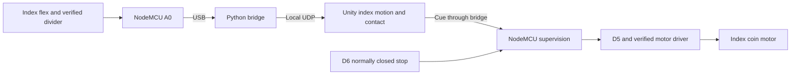

# First hardware milestone: index finger

The team has selected **one physical index finger, one flex sensor and one coin motor**. Complete this loop before expanding. **No external ADC is needed now**; A0 reads only the flex sensor, with GSR disconnected.

The physical index finger drives the virtual index finger. Virtual contact requests vibration. The root stays at a desktop preset until Quest 3 tracking is integrated; no pressure/resistance is implemented.

## Existing configuration

| Item | Setting |
|---|---|
| Firmware build | `nodemcuv2` |
| Flex input | A0 through a verified divider |
| Index motor control | D5 / GPIO14, through a driver |
| Normally closed stop to ground | D6 / GPIO12 |
| Protocol finger slot | 1: index; other four slots zero |
| Active sensor/motor masks | 2 / 0 initially; 2 / 2 after driver verification |

This is already implemented in `BoardConfig.h`, the supervisor and Unity's channel-mask handling. `motorDriverVerified` stays false until the circuit is checked. Five reserved protocol slots allow later expansion without changing packet size. The browser simulator remains a separate five-channel software demo; use the USB bridge for actual index readings and stop the simulator before starting that bridge.

## Driver and missing parts

**MOSFETs are unavailable; NPN/PNP transistors are available but their markings and the motor rating are unknown.** An identified NPN transistor can replace the MOSFET for a small DC motor if its current/thermal ratings and available base drive are adequate. Follow the NPN alternative below. Keep motor output disabled until the parts are identified and the circuit is verified.

For a standard brushed **DC/ERM coin motor**, request **one AO3400A N-channel MOSFET on a breadboard-compatible breakout**, or an equivalent single-channel switching board explicitly compatible with a 3.3 V control input and the motor's rated supply/current. AO3400A has specified on-resistance at a 2.5 V gate drive, supporting this choice for NodeMCU control. It is a small SOT-23 part, so request a breakout with headers rather than the bare chip. [Manufacturer datasheet](https://www.aosmd.com/res/data_sheets/AO3400A.pdf)

For the bare MOSFET breakout circuit, also obtain **one 1N5819 flyback diode, one approximately 100 Ohm gate resistor, and one approximately 100 kOhm gate pulldown**. Confirm actual motor current against driver/diode ratings. A driver board may already include those components; inspect its circuit. [Diode datasheet](https://www.onsemi.com/download/data-sheet/pdf/1n5817-d.pdf)

Also obtain flex-divider resistors (approximately 22 kOhm, plus 27 kOhm/10 kOhm for the conservative A0 attenuation described in the hardware guide), a normally closed stop switch, wires and a meter. Confirm motor type, rated voltage/current and the board's A0 voltage range. A 5 V adapter is not automatically suitable for the coin motor. Do not power it directly from a GPIO or the NodeMCU regulator; use a rated actuator supply. PAM8403 is an audio amplifier and is not the chosen driver.

Follow the [hardware guide](hardware-bringup.md) for the divider and MOSFET circuit. Keep actuator supplies disconnected during upload/sensor bring-up.

### NPN alternative with the available parts

Use an NPN as a low-side switch. A P2N2222A-family part is one candidate, subject to the actual manufacturer/package and motor startup current; do not assume every unidentified NPN is equivalent. [Example transistor datasheet](https://www.onsemi.com/download/data-sheet/pdf/p2n2222a-d.pdf)

| Connection | Destination |
|---|---|
| NodeMCU D5 | Correctly sized series base resistor, then NPN base B |
| NPN emitter E | Common supply/NodeMCU ground |
| NPN collector C | Motor negative |
| Motor positive | Supply matching the motor's rated voltage |
| Flyback diode cathode / anode | Motor positive / NPN collector |
| Base pulldown resistor | Base to emitter/ground |

These are terminal names, **not a physical pin order**. Identify B/C/E from the exact part's datasheet before wiring. Identify the motor type and rated voltage/current too. A clear photo of transistor markings and motor packaging can help; an unmarked motor may need its supplier specification or a controlled measurement.

The base resistor is different from the MOSFET gate resistor. Do not reuse the earlier 100 Ohm gate resistor: at 3.3 V it can demand excessive GPIO current. Size base drive using the actual transistor's saturation data and the motor's startup/load current, keeping GPIO current below the ESP8266's documented 12 mA maximum with margin. If adequate base drive cannot be supplied, use a suitable additional driver stage rather than reducing the resistor blindly. [ESP8266 electrical characteristics](https://documentation.espressif.com/0a-esp8266ex_datasheet_en.html)

PNP requires a different high-side circuit and possibly level shifting; it is not interchangeable with the NPN in this table. A base resistor and flyback diode are still required even though no MOSFET is used. Do not connect an unknown transistor circuit to the glove until its parts and off-hand behavior are verified.

## Build sequence

1. Verify NodeMCU USB communication with all actuators disconnected. MPU/PCA probing is optional for this milestone.
2. Build/measure the flex divider, upload `nodemcuv2`, and run the USB bridge on the actual port. Only index raw readings should change.
3. In Unity enable outgoing commands, capture comfortable open/closed index poses while disarmed, and verify open/half-bent/closed motion. Keep motor output disabled.
4. Verify the motor driver and rated supply off-hand, including stop behavior. Then explicitly enable the index driver in configuration and upload with actuator supply disconnected.
5. Test index contact cues off-hand, then mount with strain relief and use brief comfortable cues. Leaving contact should clear its request; other motor channels must stay zero.
6. Repeat at least 20 contact/release cycles. Test stop-loop opening, loss of commands, USB disconnect and restart. The maximum lease is 100 ms, timeout latches at 150 ms without an accepted refresh, and continuous cues stop after two seconds. Restored connections must require explicit re-arming after a fault/reset.

Record actual wiring, calibration, supply/current and failures. Software builds/tests have passed; physical wiring, sensation and hardware timing remain unverified.

## Team and expansion

A: sensor/firmware; B: Unity motion/contact; C: driver/stop/mounting; D: integration checks and demo record. After this loop passes, add analog inputs, four sensors/drivers/motors, update masks and calibrate new channels. Add Quest 3 root tracking when assigned. GSR and servo mechanisms remain separate later milestones.
