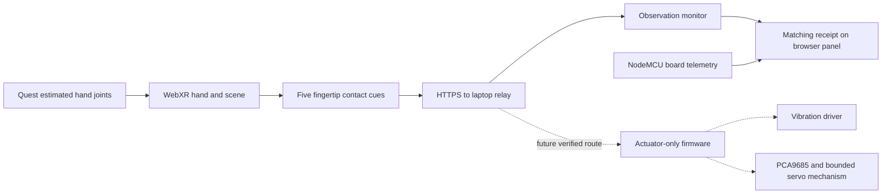

# Selected AHAM architecture — Quest Browser

The selected revision replaces Unity, flex sensors and MPU6050 as primary tracking with Quest 3 optical hand tracking in WebXR. The software now tracks both hands and all five fingers; the selected feedback hand maps to five channels. Start physical actuator bring-up with the one available index motor.

## Modules

| Module | Responsibility | Current implementation |
|---|---|---|
| Quest tracking | Estimated wrist orientation and 25 hand-joint poses | WebXR hand joints; actual headset trial pending |
| Hand view | Render joint positions and connecting bones | Independent left/right Three.js rigs; 25 joints each |
| Curl estimate | Display bending from adjacent bone angles | Approximate visual curl; no flex calibration required |
| Contact cues | All five tip spheres against material boxes | Smooth 100/pattern 1; Rough 150/2; Soft 80/3 per finger of the selected feedback hand |
| HTTPS link | Carry wireless headset requests | Temporary Cloudflare tunnel to a loopback HTTP server |
| Laptop relay | Validate requests and distinguish acceptance from receipt | Strict JSON, monitor UDP 8767, matching echoes on 8877 |
| Existing USB bridge | Observe board telemetry and echo monitor packets | COM7/230400 baud; monitor packets have no serial output route |
| Actuator-only firmware | Accept external cues without local flex calibration | Pending; current firmware needs a new mode |
| Vibration driver | Switch motor current and suppress inductive kick | Pending verified supply, circuit, diode and transistor pinout |
| Servo mechanism | Produce bounded tendon resistance | Pending; PCA9685/servos do not measure force or ensure release |

Returned joints are estimated poses; obscured joints may be emulated. Pose availability is not a confidence measurement. [Meta WebXR Hands](https://developers.meta.com/vr/documentation/web/webxr-hands/), [WebXR hand-input specification](https://immersive-web.github.io/webxr-hand-input/#xrjointspace)

## Timing and loss handling

The browser renders at the headset's supplied frame rate, submits cues at most about 20 times per second, and polls the monitor about five times per second. These are initial prototype rates, not measured latency. HTTP polling avoids new server dependencies. The tunnel adds an internet round trip; this route is suitable for the monitor checkpoint, not established as a responsive servo-control path.

Missing joints clear the affected finger's cue; missing wrist clears all five channels. A hidden XR session, stopped frames or session end clears both hand poses and all cues. Desktop preview sends zeros. Receipt ages out after 500 ms; board telemetry after 200 ms. HTTP acceptance never creates a receipt. Echoes must match a recently submitted packet, preventing another application from masquerading as WebXR receipt.

Before physical output, implement a local firmware watchdog independent of browser/network behavior, explicit arming, validated channel limits and an independent stop. Current v1 pressure/mode fields must remain zero; pressure is unsupported. Servo resistance needs a defined command and mechanism limits. Stopping servo PWM alone does not guarantee tendon release.

## Team checkpoints within the remaining event time

This revision does not restart the forty-hour event clock. Use the actual remaining time and these pass/fail gates. Estimates begin at the pivot; shorten scope if a gate misses its deadline.

| Time from pivot | Gate | Parallel team work |
|---|---|---|
| 0–1 hour | Wireless page opens; bare-hand tracking works | Headset setup; scene/relay checks; motor parts; glove placement |
| 1–2 hours | Index touches three targets; cues and echoes agree | Curl/contact capture; relay receipt logging; glove visibility trial |
| 2–4 hours | One motor gives repeatable cues on the bench | Actuator-only firmware; verified driver; timeout/stop tests |
| 4–6 hours | Worn index vibration remains reliable | Cable routing; glove tracking; measured onset; repeatable demo |
| Remaining time | Optional one-servo bench prototype, then rehearsal | Only attempt after mechanism, supply and release checks; five fingers are a stretch |

Stop servo expansion before the final two event hours. Rehearse the achieved demonstration and state its delivered feedback channel accurately. If glove tracking fails, retain the flex fallback. If motor parts remain unavailable, present live Quest tracking with calculated/received cues and identify physical actuation as incomplete.

## Hardware retained

Retain NodeMCU, glove, coin motors, drivers/diodes and power wiring. Retain PCA9685 and servos for later mechanism work. Flex sensors, divider wiring and MPU6050 become backup sensing. GSR remains outside the first demonstration.

The ESP8266 has Wi-Fi and no built-in BLE. The first route keeps it on USB. A later LAN Wi-Fi actuator route can reduce cables but needs new firmware, reconnect and watchdog validation. Do not power servos from the board's 3.3 V output, or assume the 5 V/2 A adapter can supply five loaded servos.
