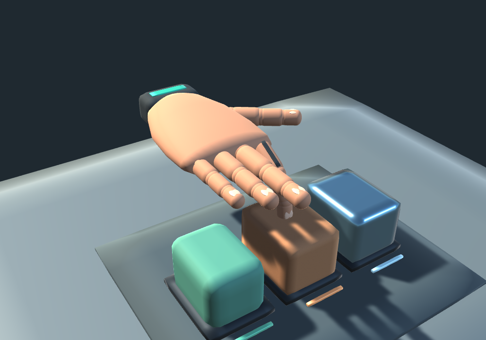

# AHAM desktop Unity project

This folder is the AHAM desktop project. Open **this folder (`unity`)** through Unity Hub's **Add project from disk** command; do not select its Assets folder or the repository root.

The editor version is 6000.6.4f1, matching this laptop. The installed editor has compiled the scripts and generated the starter scene and project settings. This uses the built-in render pipeline with no XR packages. Library/cache files are generated locally and excluded from the repository.

1. Allow the editor installation to finish in Unity Hub. Add this `unity` folder to Projects and open it.
2. Wait for import and script compilation. Check Console for red errors before proceeding.
3. Open **Assets -> AHAM -> Scenes -> AhamStarter** by double-clicking the scene in the Project panel. If you need to recreate it, choose **AHAM -> Create Desktop Starter Scene**.
4. For immediate visible movement, press **Play**: software preview defaults on and animates the index finger/wrist. Uncheck automatic animation to use the sliders. No host or hardware is needed. See [before-resistors guide](../docs/before-resistors.md) for optional MPU6050 tilt.

For the full simulated command loop:

4. In a terminal at the **repository root**, run `python host/run.py simulate --controller unity`. Keep it running. Stop any previous simulator/bridge first; use Ctrl+C in its terminal.
5. Open `http://127.0.0.1:8870` in your browser and press **Play** in Unity. The hand, three blocks and operator panel are created at runtime.
6. Turn **Software preview** off. Confirm Unity identifies **SIMULATED GLOVE**, then enable outgoing commands in its operator panel.
7. In the browser click **Open hand**; in Unity click **Capture open**. In the browser click **Close hand**; in Unity click **Capture closed**, then **Arm**.
8. Change finger curl in the browser and hand depth in Unity to make contact with the blocks. Browser output bars display simulated motor duties; no hardware is driven.

If Unity reports no fresh telemetry, confirm both programs run on the same laptop, the simulator uses `--controller unity`, and another host is not occupying the UDP ports. If an AHAM menu is missing, inspect the first red Console error; do not move source files around until that error is understood.

For a teammate's existing project, the separate Unity import ZIP still contains only the AHAM assets. It is not a complete project. See [full quickstart](../docs/quickstart.md) and [received-hardware guide](../docs/hardware-bringup.md).

The refined scene uses a shaped palm, rounded articulated fingers, an angled thumb, nails, a wrist cuff, studio lighting and three finished contact targets. Smooth/Rough/Soft buttons align the index with a target; use Desktop hand depth for contact. Calibration, outgoing commands and optional MPU settings are under **Calibration / hardware settings**. Restart Play after updating scripts; no firmware upload is needed.

